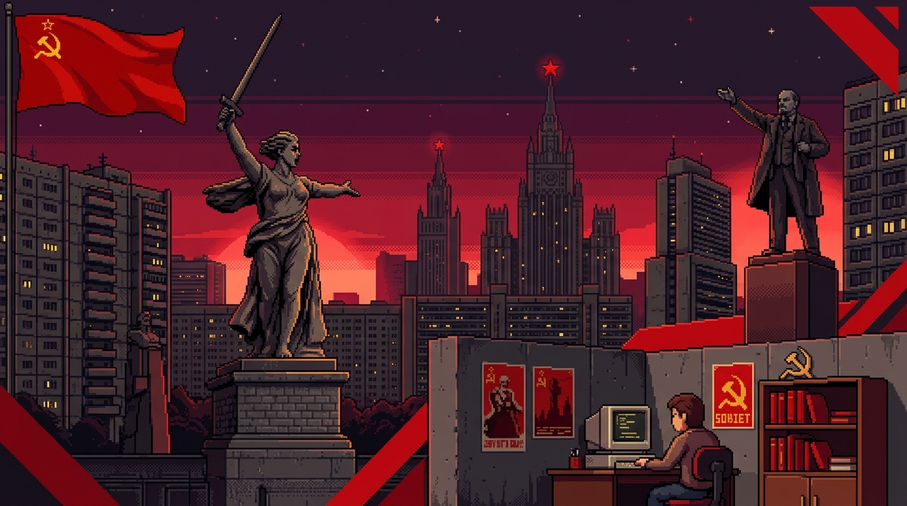

<div align="center">

<!-- MAIN BANNER -->


<!-- NAME BADGE -->


<br/>

<!-- ANIMATED TYPING SVG -->


<br/>

---


</div>

---

## ☭ About the Comrade

```
╔══════════════════════════════════════════════════════╗
║         PERSONNEL FILE — CLASSIFIED                  ║
║         Ministry of Software Engineering             ║
╠══════════════════════════════════════════════════════╣
║  Name     : Dev Vrat Trivedi                        ║
║  Division : BTech CSE '28                            ║
║  Status   : ACTIVE — Building AI, Cloud & Web        ║
║  Base     : Lucknow, UP, India 🇮🇳                   ║
║  Mission  : Open to learning & contributing          ║
╚══════════════════════════════════════════════════════╝
```

<div align="center">

🤖 **Currently Working On** → AI & Cloud Projects
📖 **Currently Learning** → ML, Cloud & System Design
🤝 **Open To** → Collaborations & Open Source
🗿 **Fun Fact** → My code stands as tall as The Motherland Calls

</div>

---

## 🔴 Arsenal of the Comrade *(Tech Stack)*

<div align="center">

### ⚒️ Languages


### 🏛️ Frameworks & Tools


### 🏢 Bloc Infrastructure


</div>

---

## 🏗️ Five Year Plan *(GitHub Stats)*

<div align="center">


<br/><br/>


<br/>


</div>

---

## 🗿 Monuments of Work *(Featured Projects)*

<div align="center">

[](https://github.com/dev-vrats/VibeFlow-AI)
[](https://github.com/dev-vrats/Interview_Mate)

[](https://github.com/dev-vrats/TalkBack)
[](https://github.com/dev-vrats/AI-assistant)

</div>

---

## 🚩 Contact the Comrade

<div align="center">

[](https://www.linkedin.com/in/dev-vrat-trivedi/)
[](mailto:subrattrivedi3@gmail.com)
[](https://github.com/dev-vrats)
[](https://www.instagram.com/d3vvrat/)

<br/>

---

*"The Motherland does not debug itself. Forward, Comrade!"* 🗿☭


</div>
